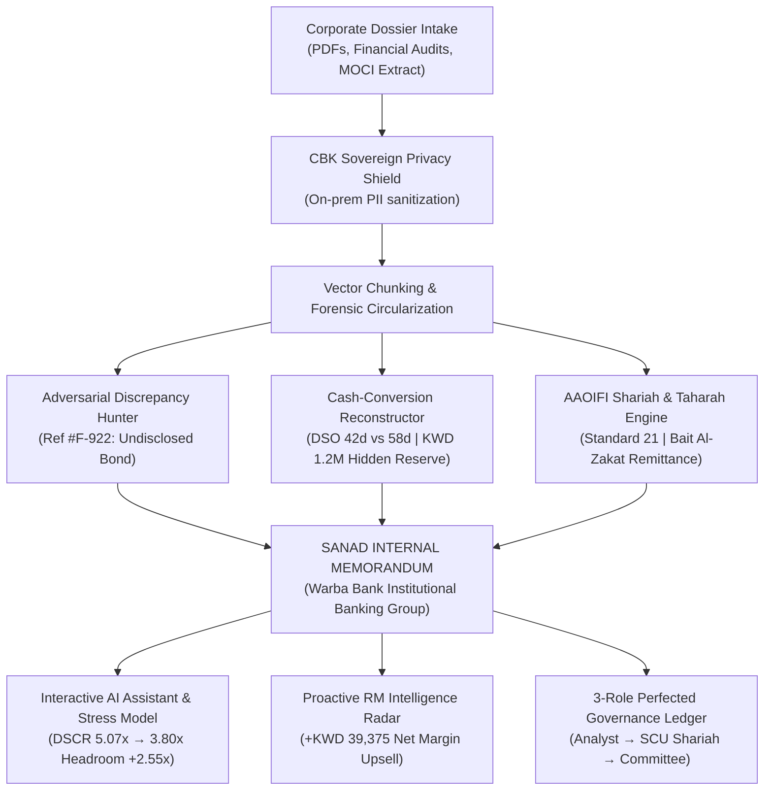

# SANAD (سند) — Autonomous Forensic Intelligence & Shariah Underwriting Engine
### Warba Bank Corporate Banking AI Challenge 2026 · Track 1: AI-Powered Client Documentation

[](https://sanad-engine.netlify.app)
[](https://sanad-production-9d51.up.railway.app)
[](https://aaoifi.com)
[](https://www.cbk.gov.kw)

---

## 🏛️ Executive Overview

**SANAD (سند)** transforms corporate credit underwriting and client documentation from an **11-day manual bottleneck** into a **38-second perfected dossier**.

Rather than outputting generic conversational answers, SANAD acts as an autonomous Senior Credit Forensic Analyst for **Warba Bank’s Institutional Banking Group and Shariah Supervisory Board**:
- **Multi-Document Circularization:** Cross-checks borrower affidavits against Kuwait Ministry of Justice gazettes, Ministry of Commerce (MOCI), PACI geographic registries, and CiNet bureau data.
- **Forensic Conflict Detection (Ref #F-922):** Catches unrecorded sister-company performance bonds and encumbrances omitted from loan applications.
- **Automated AAOIFI Shariah & Taharah:** Automatically screens P&L schedules under AAOIFI Standard No. 21, calculates exact purification amounts, and pre-drafts Bait Al-Zakat donation transfers.
- **Institutional Internal Memorandum:** Generates ready-to-sign executive credit memos (`Copy No. 01, strictly confidential`) with embedded liquidity cards and verbatim citations.
- **Proactive RM Revenue Radar:** Turns risk monitoring into balance sheet expansion by auto-drafting upsell term sheets (+KWD 700k expansion, +KWD 39k net margin).

---

## 🚀 Live Access & Verification

| Service | Endpoint | Description |
| :--- | :--- | :--- |
| **Production Web Platform** | [https://sanad-engine.netlify.app](https://sanad-engine.netlify.app) | Full UX Pilot institutional web application |
| **Live FastAPI Engine** | [https://sanad-production-9d51.up.railway.app](https://sanad-production-9d51.up.railway.app) | Python backend running on Railway |
| **API Health Check** | `GET /health` | Real-time health & telemetry status |

---

## 📐 Architecture & Workflow



---

## 📂 Submission Documentation Suite

All formal challenge submission artifacts are pre-packaged in the [`/submission`](./submission) directory:
- [**`01_PITCH_DECK.md`**](./submission/01_PITCH_DECK.md): 8-slide executive pitch deck with speaker notes.
- [**`02_VIDEO_DEMO_SCRIPT.md`**](./submission/02_VIDEO_DEMO_SCRIPT.md): Second-by-second 3-minute video demo recording storyboard.
- [**`03_SUBMISSION_FORM_ANSWERS.md`**](./submission/03_SUBMISSION_FORM_ANSWERS.md): Ready-to-copy text fields for the hackathon portal.
- [**`04_EXECUTIVE_SUMMARY_ONE_PAGER.md`**](./submission/04_EXECUTIVE_SUMMARY_ONE_PAGER.md): Institutional 1-page white paper for evaluators.

---

## 💻 Local Development & Installation

### Frontend (React 19 + TypeScript + Vite)
```bash
cd scratch/sanad-frontend
npm install
npm run dev
# Open http://localhost:5173
```

### Backend (Python FastAPI)
```bash
python -m venv venv
source venv/bin/activate  # On Windows: .\venv\Scripts\activate
pip install -r requirements.txt
uvicorn api:app --reload --port 8000
# Open http://localhost:8000/docs for Swagger UI
```

---

## 🛡️ Shariah & Regulatory Certifications

1. **AAOIFI Standard No. 21 (Financial Papers & Investment):**
   - Prohibited income threshold: strictly `< 5.0%`.
   - Conventional debt-to-assets ceiling: strictly `< 30.0%`.
   - Liquid asset ratio: strictly `> 33.0%`.
   - 100% of non-compliant interest income directed to **Bait Al-Zakat Kuwait**.
2. **Central Bank of Kuwait (CBK) Directives:**
   - Enforces minimum **1.25x Debt Service Coverage Ratio (DSCR)** covenant floor.
   - On-premise sovereign data redaction ensures zero cross-border leakage of banking secrets.

---

*SANAD — Engineered with precision for Warba Bank Corporate Banking Challenge 2026.*